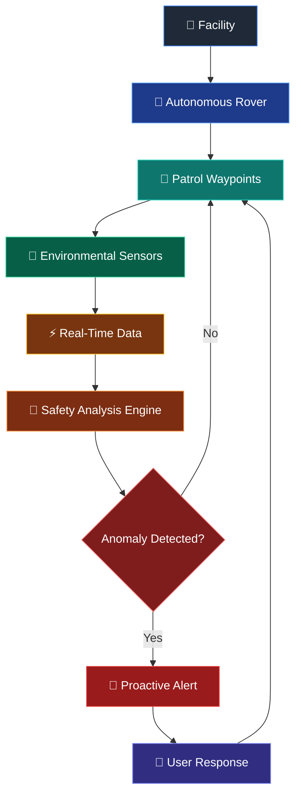
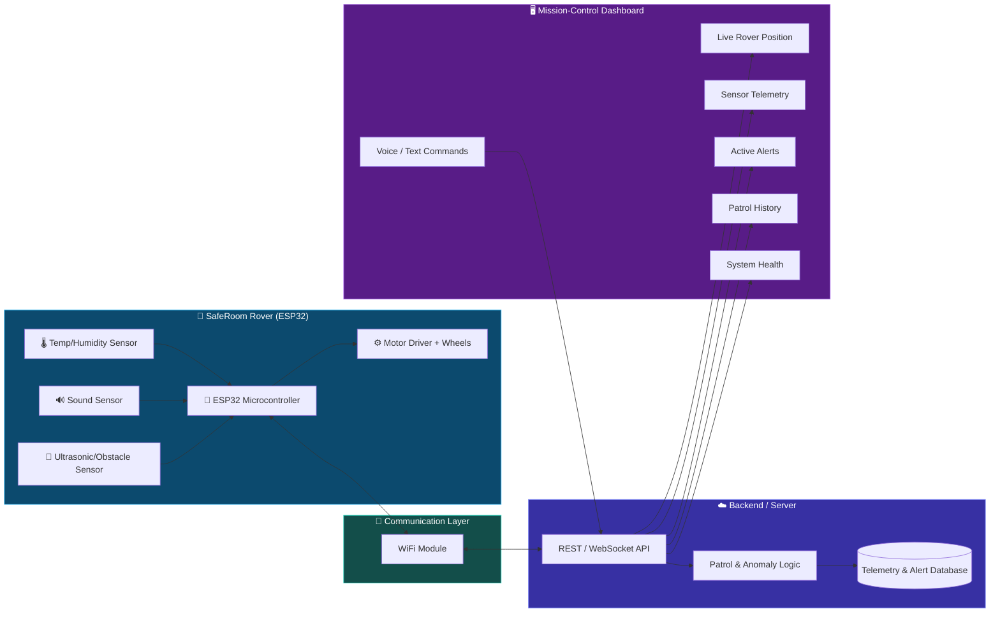
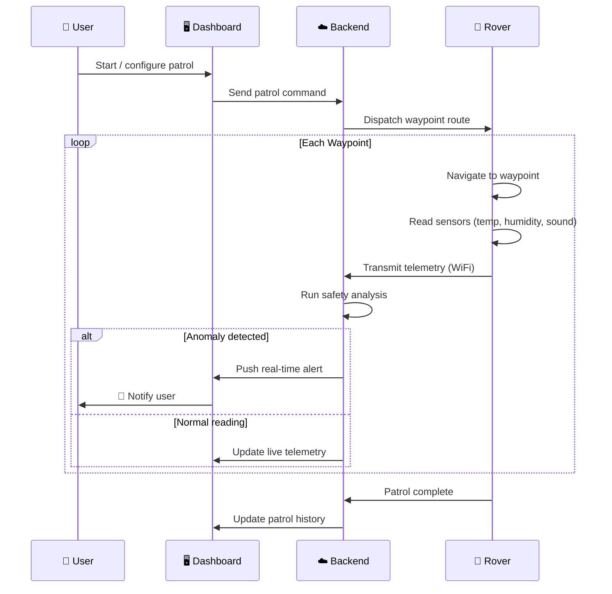
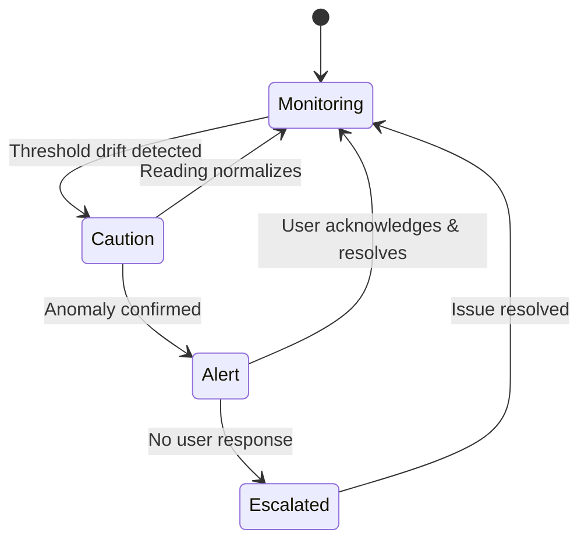

<div align="center">

```
 ███████╗ █████╗ ███████╗███████╗██████╗  ██████╗  ██████╗ ███╗   ███╗
 ██╔════╝██╔══██╗██╔════╝██╔════╝██╔══██╗██╔═══██╗██╔═══██╗████╗ ████║
 ███████╗███████║█████╗  █████╗  ██████╔╝██║   ██║██║   ██║██╔████╔██║
 ╚════██║██╔══██║██╔══╝  ██╔══╝  ██╔══██╗██║   ██║██║   ██║██║╚██╔╝██║
 ███████║██║  ██║██║     ███████╗██║  ██║╚██████╔╝╚██████╔╝██║ ╚═╝ ██║
 ╚══════╝╚═╝  ╚═╝╚═╝     ╚══════╝╚═╝  ╚═╝ ╚═════╝  ╚═════╝ ╚═╝     ╚═╝
```

### 🛡️ Autonomous Safety Patrol & Environmental Monitoring Rover

**A WiFi-connected autonomous rover that patrols indoor environments, monitors safety conditions, detects anomalies, and provides real-time control and proactive alerts through a web-based mission-control dashboard.**


</div>

---

## 🚨 Overview

SafeRoom is an autonomous indoor safety patrol system designed to provide **continuous monitoring** of rooms and facilities without requiring a person to be physically present at every location.

The system combines an **ESP32-based mobile rover**, environmental sensors, autonomous patrol logic, WiFi communication, voice/text commands, and a real-time web dashboard.

Instead of simply displaying sensor readings, SafeRoom continuously evaluates the environment and turns abnormal conditions into **actionable safety alerts**.

<div align="center">

| 🏠 Homes | 👵 Elderly-Care | 🏥 Hospital Wards | 🏢 Offices | 🏭 Industrial |
|:---:|:---:|:---:|:---:|:---:|

</div>

---

## 🎯 Problem

Traditional safety monitoring systems are often **stationary**. A fixed sensor can monitor one location, but it cannot physically move between different rooms.

<table>
<tr>
<td width="50%" valign="top">

### ❌ Without SafeRoom
- Important areas may remain unmonitored
- Multiple fixed sensors required per room
- Environmental changes go unnoticed
- Manual inspection is repetitive
- Hard to scale in large facilities
- Raw sensor data ≠ actionable info

</td>
<td width="50%" valign="top">

### ✅ With SafeRoom
- One rover, many rooms
- Continuous autonomous coverage
- Environmental drift caught early
- No repetitive manual walk-throughs
- Scales by adding waypoints, not hardware
- Sensor data → analyzed → alert

</td>
</tr>
</table>

---

## 💡 Solution

SafeRoom uses an autonomous rover that moves between **predefined room waypoints**. While patrolling, the rover collects environmental data such as:

| Sensor | Measures | Why It Matters |
|--------|----------|-----------------|
| 🌡️ Temperature | Ambient room temp | Detects fire risk, HVAC failure, cold exposure |
| 💧 Humidity | Moisture levels | Flags leaks, mold risk, discomfort conditions |
| 🔊 Sound Level | Ambient noise/spikes | Detects distress calls, alarms, unusual activity |
| 📡 Obstacle/Navigation | Distance & positioning | Safe autonomous movement between waypoints |

Data streams over **WiFi** to the monitoring system, and the **web dashboard** turns it into a live safety picture.

---

## 🧠 Key Idea — Data-to-Action Pipeline



---

## 🏗️ System Architecture



---

## 🔄 Patrol Cycle (Sequence)



---

## 🚦 Room Safety State Machine



---

## 🧩 Feature Highlights

<div align="center">

| Feature | Description |
|---|---|
| 📍 **Autonomous Patrol** | Rover navigates predefined waypoints without manual control |
| 📊 **Live Dashboard** | Real-time rover position, telemetry, and patrol progress |
| 🚨 **Proactive Alerts** | Converts raw sensor data into actionable safety notifications |
| 🗣️ **Voice/Text Commands** | Control and query the rover through natural commands |
| 🕓 **Patrol History** | Full log of past patrols, readings, and triggered alerts |
| ❤️ **System Health** | Battery, connectivity, and sensor status monitoring |

</div>

---

## 🛠️ Tech Stack

<div align="center">


</div>

---

## 📦 Repository Structure (Suggested)

```text
SafeRoom/
├── firmware/            # ESP32 rover code (sensors, navigation, WiFi)
├── backend/             # API, patrol logic, anomaly detection, DB
├── dashboard/           # Web-based mission-control frontend
├── docs/                # Diagrams, architecture notes, setup guides
└── README.md
```

---

## 🌱 Roadmap

- [ ] Core patrol loop + waypoint navigation
- [ ] Environmental sensor integration
- [ ] Real-time WebSocket telemetry to dashboard
- [ ] Anomaly detection & alert engine
- [ ] Voice/text command interface
- [ ] Patrol history & analytics view
- [ ] Multi-rover / multi-facility support

---

<div align="center">

### 🛡️ SafeRoom — because safety shouldn't wait for someone to walk in.

</div>